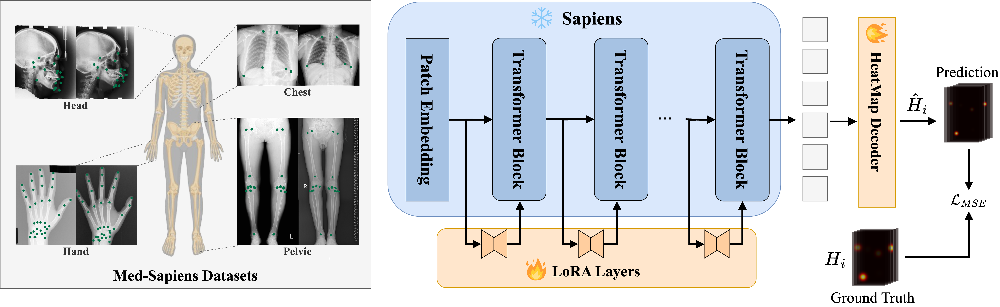

# MedSapiens: Taking a Pose to Rethink Medical Imaging Landmark Detection
<div align="center">

[]()


</div>

###### [Marawan Elbatel](https://marwankefah.github.io/), [Anbang Wang](https://aawangas.github.io), Keyuan Liu, Kaouther Mouheb, Enrique Almar-Munoz, Lizhuo Lin, Yanqi Yang, [Karim Lekadir](https://www.icrea.cat/community/icreas/26227/karim-lekadir/), [Xiaomeng Li](https://xmengli.github.io/)


This paper does not introduce a novel architecture; instead, it revisits a fundamental yet overlooked baseline: adapting human-centric foundation models for anatomical landmark detection in medical imaging. While landmark detection has traditionally relied on domain-specific models, the emergence of large-scale pre-trained vision models presents new opportunities. In this study, we investigate the adaptation of **Sapiens**, a human-centric foundation model, for medical imaging through multi-dataset pretraining, establishing a new state-of-the-art across multiple datasets. Our proposed model, **MedSapiens**, demonstrates that human-centric foundation models—naturally optimized for spatial pose localization—provide strong priors for anatomical landmark detection, yet this potential has remained largely untapped. 





## Features
- **Universal Framework**: Adaptable for multiple medical imaging datasets.
- **LoRA Fine-Tuning**: Adapts SAPIENS for medical-specific datasets.

| **Method**                                           | **Head Dataset**  | **Hand Dataset**  | **Chest Dataset** | **Leg Dataset**   |
|------------------------------------------------------|-------------------|-------------------|-------------------|-------------------|
| [NFDP](https://github.com/jacksonhzx95/NFDP)                 | 1.245 ± 0.276     | 0.673 ± 0.152     | 5.13 ± 1.44       | 2.685 ± 0.617     |
| [UniverDetect](https://doi.org/10.1016/j.neucom.2024.128157) | 1.55 ± 1.74       | 0.71 ± 1.78       | 4.06 ± 3.73       | N/A               |
| [Sapiens](https://github.com/facebookresearch/sapiens) + LoRA      <br/>                        | 1.246 ± 0.270     | 0.705 ± 0.116     | 3.846 ± 1.27      | 2.647 ± 0.572     |
| **MedSapiens**                                       | 1.275 ± 0.285     | 0.664 ± 0.110     | **3.715 ± 1.31**  | 2.691 ± 0.555     |
| **+ LoRA** 🚀                                        | **1.244 ± 0.276** | **0.638 ± 0.106** | 3.734 ± 1.24      | **2.509 ± 0.556** |


## Getting Started

### Clone the Repository
```bash
git clone https://github.com/xmed-lab/MedSapiens
```

### Installation 
MedSapiens follow strictly [**SAPIENS installation pipeline**]().

#### 1. Set up the Environment
Use the provided installation script to create and configure the `sapiens` environment:
```bash
conda create -n sapiens python=3.10 -y
conda activate sapiens
```

#### 2. Install Dependencies
Install PyTorch and CUDA (12.1 or 11.8):
```bash
conda install pytorch==2.4.0 torchvision==0.19.0 torchaudio==2.4.0 pytorch-cuda=12.1 -c pytorch -c nvidia
```
Install additional Python libraries:
```bash
pip install chumpy scipy munkres tqdm cython numpy==1.26.4 pandas fsspec yapf==0.40.1 matplotlib packaging omegaconf ipdb ftfy regex
```
Install MMCV (CUDA: 12.1 or 11.8):
```bash
pip install mmcv==2.2.0 -f https://download.openmmlab.com/mmcv/dist/cu121/torch2.4/index.html
```

#### 3. Install Custom Modules
Install the required modules in editable mode:
```bash
bash pip_install_editable.sh
```

### Data and Model Weights
#### 1. Download Data

Download the dataset package from the link below and extract it to the `data/` directory:

```
gdown --id 1G_3Gir_MJ2Hbm4A2Oqwcy579Mgo2hpYQ -O med_sapien.zip
unzip med_sapien.zip -d data/
```

The resulting structure should look like:

```
data/
└─ med_sapien/
    ├─ Images/
    └─ [dataset-specific JSON annotation files]
```
#### 2. Download Model Weights
To set up the model weights, first download the original **Sapiens** checkpoint, followed by the **Med-Sapien** weights.

- The original Sapiens 0.3B checkpoint is downloaded automatically via`wget`.
- Med-Sapien weights can be retrieved through the gdown (Google Drive link).

```bash
mkdir -p src/pretrain/checkpoints/sapiens_0.3b
wget https://huggingface.co/facebook/sapiens-pretrain-0.3b/resolve/main/sapiens_0.3b_epoch_1600_clean.pth \
    -O src/pretrain/checkpoints/sapiens_0.3b/sapiens_0.3b_epoch_1600_clean.pth

gdown --id 1Nxes7MczB3dNvA2JMtGXcSEUEk8gQg4F -O checkpoints.zip
unzip checkpoints.zip
```

The downloaded weights will have the following directory structure:
```
checkpoints/
└── med_sapien/
    ├──best_EPE_epoch_199.pth
    ├── head/
    │   └── best_EPE_epoch_200.pth
    ├── hand/
    │   └── best_EPE_epoch_207.pth
    ├── chest/
    │   └── best_EPE_epoch_10.pth
    └── legs/
        └── best_EPE_epoch_208.pth
```


## 🎯 Customized MedSapien

### LoRA Fine-Tuning 
Use the `lora_med_sapiens.sh` script to fine-tune the model. Specify the dataset (`chest`, `hand`, `head`, or `leg`).

```bash
bash scripts/train/lora_med_sapiens.sh <DATASET>
```
- Example:
```bash
bash scripts/train/lora_med_sapiens.sh chest
```

### Testing
Use the below script to evaluate the model:
```bash
bash scripts/test/lora_med_sapiens.sh <DATASET>
```
- Example:
```bash
bash scripts/test/lora_med_sapiens.sh chest
```

### Evaluation
To evaluate the model predictions, use the `evaluate.py` script. Specify the required arguments:

```bash
python evaluate.py \
    --annotations path/to/annotations.json \
    --predictions path/to/predictions.pkl \
    --output-dir path/to/output/dir \
    [--keypoint-order path/to/keypoint_order.json] \
    [--save-vis]
```

- Example:
```bash
python evaluation/evaluate.py \
    --annotations data/med_sapien/chest_coco_test_annotations.json \
    --predictions src/pose/Outputs/test_lora/chest/lora_med_sapiens_0.3b-210e_chest-1024x768/test_dump.pkl \
    --output-dir src/pose/Outputs/evaluation/chest 
```

### Configurations
- Adjust batch sizes, devices, and other parameters directly in the `.sh` scripts as needed.
- Update paths for dataset annotations and checkpoints in the `configs/` directory.

## 🤝 Acknowledgements & Contributions
This project builds on the exceptional work by [SAPIENS](https://github.com/facebookresearch/sapiens). Contributions and collaborations are welcome! For questions or issues, please open a GitHub issue.

## 📚 Citation
If you find this work useful, please cite the forthcoming paper:
```
@article{medsapien2024,
  title={MedSapien: Taking a Pose to Rethink Medical Imaging Landmark Detection},
  author={},
  arxiv={soon},
  year={2025}
}
```

## 📜 License
This project is licensed under the [SAPIENS License](LICENSE). Portions derived from open-source projects adhere to [Apache 2.0](https://www.apache.org/licenses/LICENSE-2.0).
